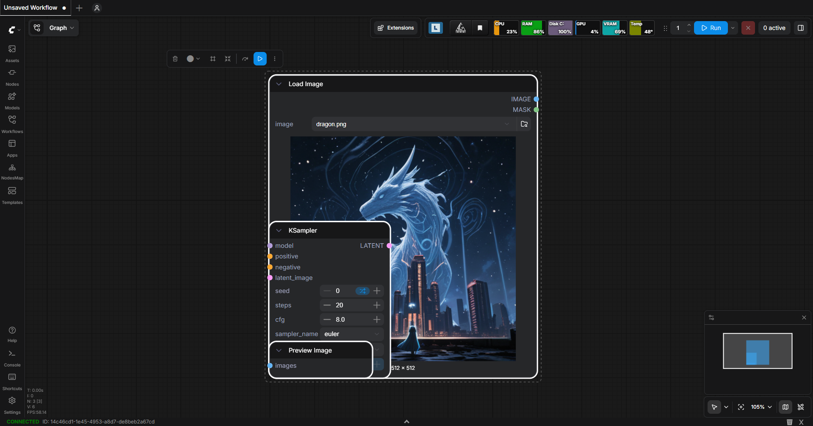
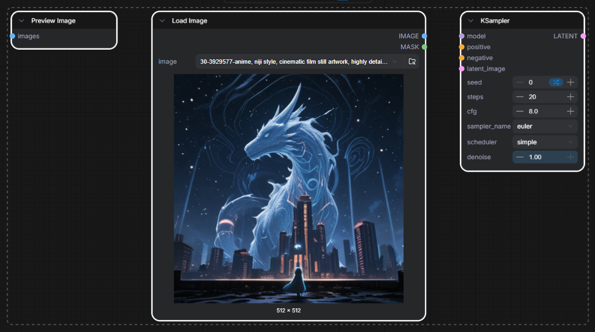
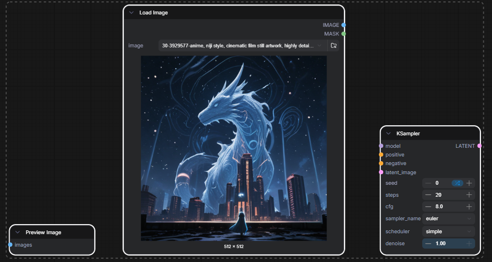
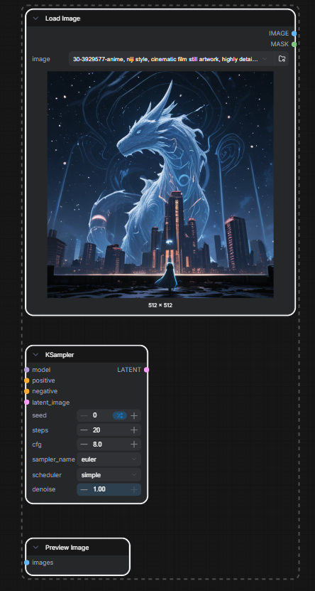
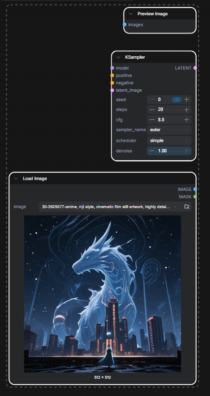
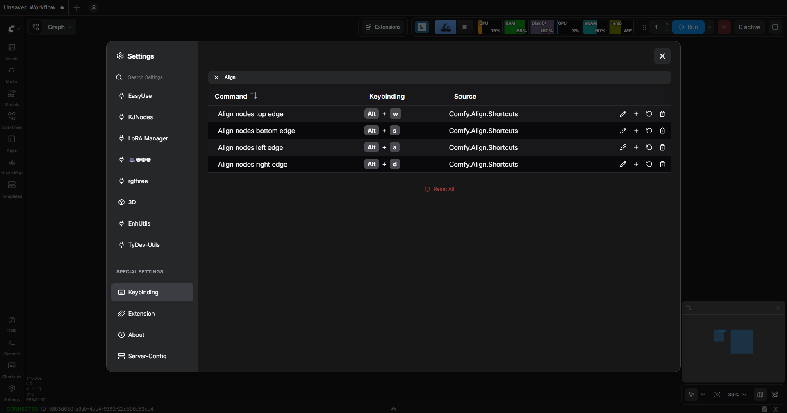

<div align="center">

# ComfyUI-Align Shortcuts

Shortcuts designed to help align nodes in a comfyui editor.
<br>
_Based on <https://github.com/coolzilj/ComfyUI-LJNodes>._

[](https://github.com/m21-cerutti/comfyui-align-shortcuts/releases/latest/)
[](https://github.com/m21-cerutti/comfyui-align-shortcuts/releases)
[](https://github.com/m21-cerutti/comfyui-align-shortcuts/releases)
[](https://github.com/m21-cerutti/comfyui-align-shortcuts/releases/latest/)


<br>

</div>

<!-- omit in toc -->
## Summary

- [Description](#description)
- [Installation](#installation)
  - [ComfyUI Manager (Recommended)](#comfyui-manager-recommended)
  - [Git Clone / Symlink Setup (Advanced/Manual)](#git-clone--symlink-setup-advancedmanual)
- [Usage](#usage)
  - [Align nodes shortcuts](#align-nodes-shortcuts)
  - [Changing Keybindings](#changing-keybindings)
- [Kown issues](#kown-issues)
- [Contribution Guide](#contribution-guide)
- [Authors](#authors)
- [License](#license)
- [Acknowledgments](#acknowledgments)

## Description

This custom node suite provides intuitive shortcuts to align groups of nodes within the ComfyUI editor.

It address limitations found in others alignment tools, like [ComfyUI-Align not supporting Node 2.0](https://github.com/Moooonet/ComfyUI-Align/issues/14), and [ComfyUI-LJNodes](https://github.com/coolzilj/ComfyUI-LJNodes) that was abandonned.

## Installation

### ComfyUI Manager (Recommended)

This is the easiest method:

1. Open ComfyUI and go to `Manager` > `Install Custom Nodes`.
2. Search for `Align nodes` in the search bar.
3. Click `Install`.

### Git Clone / Symlink Setup (Advanced/Manual)

> ComfyUI must be installed and running (see [requirements](https://docs.comfy.org/installation/system_requirements)).
> Keep in mind where is your path for models, we will use `$COMFYUI_ROOT` in documentation.

1. Navigate to the target `custom_nodes` folder inside your main ComfyUI installation:

    ```bash
    cd $COMFYUI_ROOT/custom_nodes
    ```

2. Clone the repository with:

    ``` bash
    git clone https://github.com/m21-cerutti/ComfyUI-Align-Shortcuts.git
    ```

## Usage

### Align nodes shortcuts

1. Select the desired group of nodes by clicking `Alt` and dragging over them, or holding `Shift` + click to select individual nodes.
2. Use the configured shortcut keys, by default:

    - `Alt + W`: Aligns all selected nodes vertically by their top edge.

    

    - `Alt + S`: Aligns all selected nodes vertically by their bottom edge.

    

    - `Alt + A`: Aligns all selected nodes horizontally by their left edge.
  
    

    - `Alt + D`: Aligns all selected nodes horizontally by their right edge.
  
    

### Changing Keybindings

Keybinding customization is handled by ComfyUI's settings. To change the shortcut used for node alignment:

1. Access the ComfyUI Interface Settings and search for "Align node".
2. Modify the existing keymap entries assigned to our shortcuts (`Alt + W/A/S/D`).



For full documentation, please see: <https://docs.comfy.org/interface/shortcuts>

## Kown issues

- We can't use `Alt + Arrow` for keybing when there is selected nodes.

See <https://github.com/Comfy-Org/ComfyUI_frontend/issues/12112>

## Contribution Guide

This project welcomes contributions! If you find a bug or want to add a feature, please instructions inside [CONTRIBUTING.md](CONTRIBUTING.md)

## Authors

- Marc CERUTTI
- Initial author [@SongZi](https://x.com/Songzi39590361)

## License

This project is licensed under the MIT License - see the [LICENSE](LICENSE) file for details.

## Acknowledgments

Others utilities tools for inspiration and useful in ComfyUI journey :

- <https://github.com/Moooonet/ComfyUI-Align>
- <https://github.com/ty0x2333/ComfyUI-Dev-Utils>
- <https://github.com/StableLlama/ComfyUI-basic_data_handling/tree/main>
